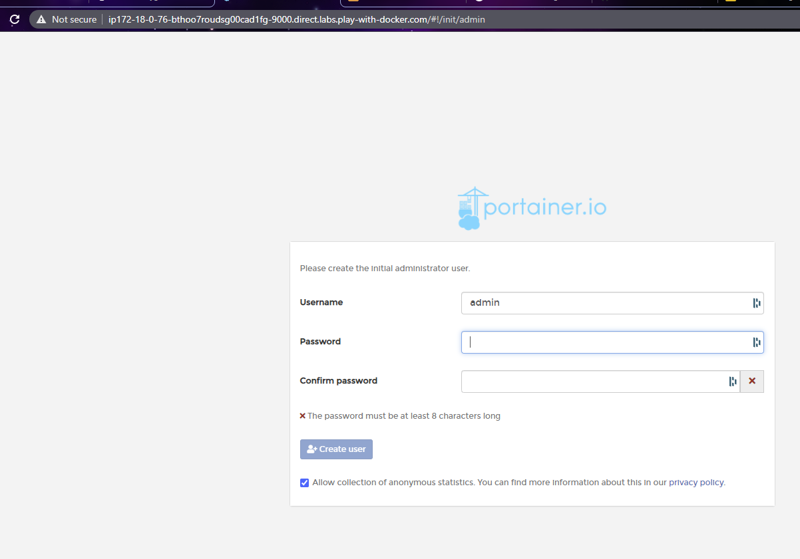
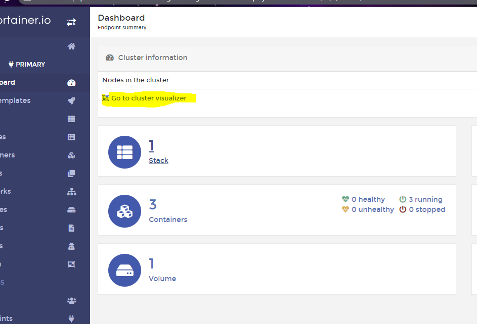
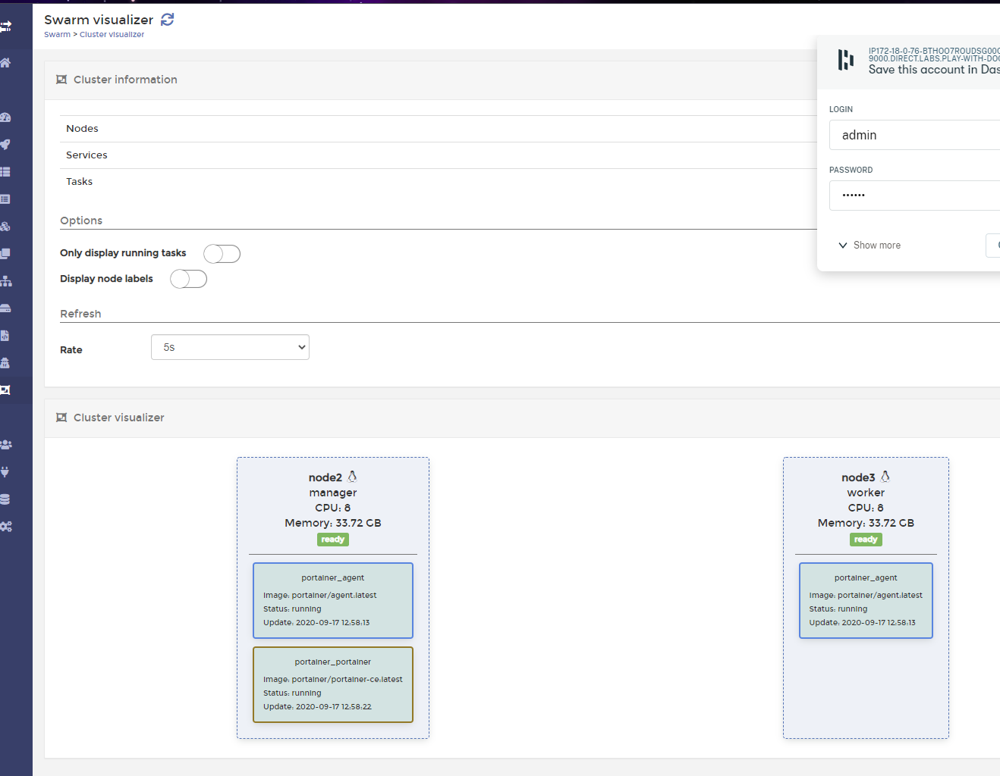

# swarm

1. `docker swarm init --advertise-addr <ip>`
2. paste the `docker swarm join ...` on additional "machines"
3. deploy portainer
  - `curl -L https://downloads.portainer.io/portainer-agent-stack.yml -o portainer-agent-stack.yml && docker stack deploy --compose-file=portainer-agent-stack.yml portainer`
4. click port 9000 to view

5. create a password

6. view the visualizer

7. you now have a Docker Swarm cluster.
8. `git clone https://github.com/microservices-demo/microservices-demo && cd microservices-demo && docker-compose pull && docker stack deploy --compose-file deploy/docker-swarm/docker-compose.yml sockshop`
